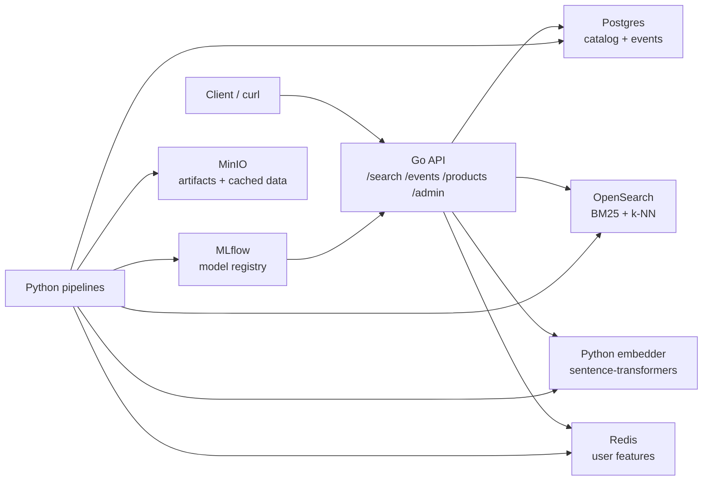

# DruSearch

DruSearch is a local-first e-commerce search stack. It combines lexical search, dense retrieval, click/event feedback, and a configurable Learning-to-Rank trainer so product results can improve from behavior.

The project is intentionally production-shaped, but runnable on one machine with Docker Compose.

## Architecture



Search flow:

1. The API embeds the query with the Python embedder.
2. OpenSearch retrieves BM25 and vector candidates.
3. The API fuses candidates with RRF.
4. The served LTR reranker optionally reorders candidates.
5. Impression/click/purchase events feed future training data.

## Main Workflows

### Start Fresh

```bash
make bootstrap-search
```

That one command creates `.env` when needed, starts Docker, loads real Amazon
Shopping Queries / ESCI products and graded relevance judgments, builds search
indexes, simulates behavior, trains the default ranker, promotes it, and
reloads the API.

Then search:

```bash
curl -G http://localhost:8080/search \
  --data-urlencode "q=running shoes" \
  --data-urlencode "k=5"
```

### Use A New Feature Or Label Change

After adding or changing an LTR feature, label rule, or teacher-label input,
run one target:

```bash
make retrain-model
```

That rebuilds product and user features, rebuilds training rows, labels them
with the offline BGE teacher, trains, promotes, verifies, and reloads the API.

If the shared feature schema changed, use this instead:

```bash
make retrain-model-with-schema
```

If you also want fresh simulated behavior before retraining:

```bash
make retrain-model-with-sim
```

### Compare Rankers

```bash
make compare-ltr-backends
```

Comparison logs and a summary are written under
`reports/ltr-backends/<timestamp>/`, and evaluation runs are logged to MLflow
at `http://localhost:5000`.

### Promote A Manually Trained Model

If you trained or evaluated manually and want the API to use that model:

```bash
make promote-and-reload
```

To require the non-regression gate first:

```bash
make gate-and-promote
```

LightGBM is the default backend. To retrain and serve XGBoost instead:

```bash
LTR_MODEL_BACKEND=xgboost make retrain-model
```

Use the same prefix with `make promote-and-reload` when you want that workflow
to use XGBoost. `make compare-ltr-backends` always runs both backends.

Promotion writes the model artifact plus metadata into `models/`:

| Backend | Model artifact | Metadata |
|---|---|---|
| LightGBM | `models/ltr_reranker.txt` | `models/ltr_reranker.json` |
| XGBoost | `models/ltr_reranker.xgb.json` | `models/ltr_reranker.json` |

The API reads `models/ltr_reranker.json` when it reloads and chooses the
matching scorer. Commit the model artifact and metadata when you want another
machine to serve the same trained ranker without retraining.

## Command Reference

| Command | Purpose |
|---|---|
| `make up` / `make down` | Start or stop the local Docker Compose stack. |
| `make ready` | Wait for API dependency readiness. |
| `make bootstrap-search` | Run the complete initial local demo workflow. |
| `make seed-catalog` | Load real ESCI shopping-query products and judgments. |
| `make seed-amazon-reviews` | Load Amazon Reviews metadata for catalog-only demos. |
| `make retrain-model` | Rebuild labels/features, train, promote, verify, and reload. |
| `make retrain-model-with-schema` | Regenerate shared feature schema, then retrain and reload. |
| `make retrain-model-with-sim` | Generate fresh simulated events, then retrain and reload. |
| `make train-ltr` / `make eval` | Train or evaluate the configured LTR backend. |
| `make compare-ltr-backends` | Train and evaluate LightGBM and XGBoost back-to-back. |
| `make promote-and-reload` | Copy the selected model to `models/`, verify it, and load it in the API. |
| `make gate-and-promote` | Run the promotion gate, then promote and reload. |
| `make use-checked-in-model` | Restart the API and load the checked-in model artifact. |
| `make metrics` | Show DruSearch Prometheus metrics. |
| `make test-go` / `make test-py` | Run Go or Python tests. |

## API

The API runs at `http://localhost:8080`.

| Method | Path | Purpose |
|---|---|---|
| `GET` | `/healthz` | Process liveness. |
| `GET` | `/readyz` | Dependency readiness. |
| `GET` | `/metrics` | Prometheus metrics. |
| `GET` | `/search?q=...&k=...` | Product search. |
| `POST` | `/events` | Impression, click, or purchase feedback. |
| `GET` | `/products/{id}` | Product lookup. |
| `POST` | `/admin/reload-model` | Reload the promoted LTR model. |

Admin endpoints require `ADMIN_TOKEN` in `.env`.

`/search` accepts an optional `ranker` query parameter:

```bash
curl -G http://localhost:8080/search \
  --data-urlencode "q=nike shoes that are low cost" \
  --data-urlencode "k=10" \
  --data-urlencode "ranker=ltr"
```

Supported values are `hybrid`/`rrf` for BM25+kNN retrieval order and `ltr` for the local served LTR model. LTR is the default; set `DEFAULT_RANKER=hybrid` or pass `ranker=hybrid` when you want retrieval-only ranking. BGE cross-encoder scoring runs offline during the retrain workflows.

## Project Layout

| Path | Purpose |
|---|---|
| `services/api-go` | Go search API, retrieval, features, reranking, events. |
| `services/embedder-py` | FastAPI embedding sidecar. |
| `pipelines` | Ingest, indexing, embedding, simulation, training, evaluation. |
| `libs/schema` | Shared LTR feature schema and codegen. |
| `infra` | Local Postgres and OpenSearch setup. |
| `docs` | Architecture notes, PRD, runbook, implementation plans. |

## More Docs

- [Architecture](docs/ARCHITECTURE.md)
- [Runbook](docs/RUNBOOK.md)
- [Product requirements](docs/PRD.md)
