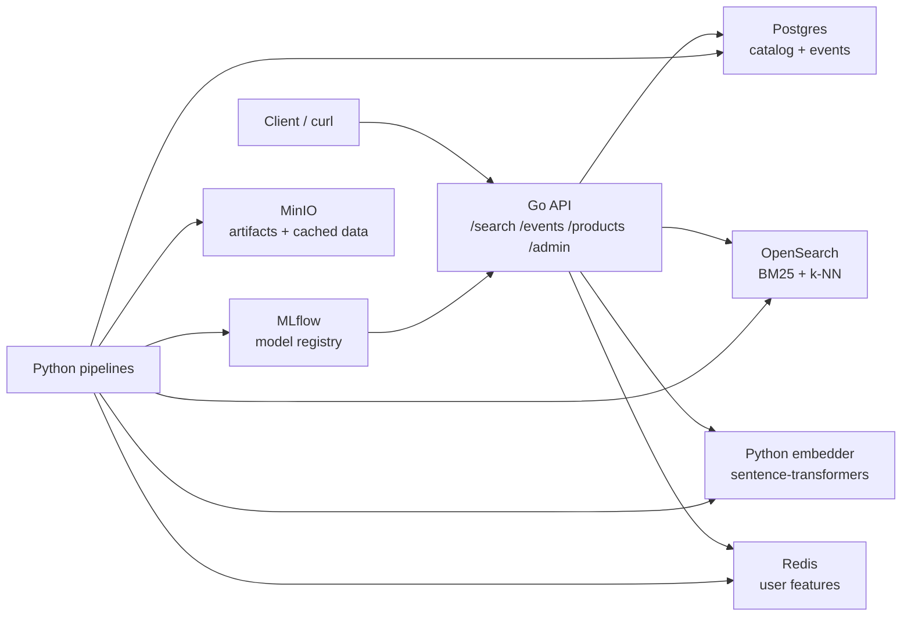

# DruSearch

DruSearch is a local-first e-commerce search stack. It combines lexical search, dense retrieval, click/event feedback, and a LightGBM Learning-to-Rank reranker so product results can improve from behavior.

The project is intentionally production-shaped, but runnable on one machine with Docker Compose.

## Architecture



Search flow:

1. The API embeds the query with the Python embedder.
2. OpenSearch retrieves BM25 and vector candidates.
3. The API fuses candidates with RRF.
4. The LightGBM reranker optionally reorders candidates.
5. Impression/click/purchase events feed future training data.

## Quick Start

```bash
cp .env.example .env
make up
make ready
make seed-databases
make embed-vectors
```

Then search:

```bash
curl -G http://localhost:8080/search \
  --data-urlencode "q=running shoes" \
  --data-urlencode "k=5"
```

`make ready` only checks service health. A fresh stack still needs `make seed-databases` before `/search` has products to return.

## Full Demo Loop

To run the complete local workflow with data, vectors, simulated behavior, feature aggregation, model training, promotion, and API reload:

```bash
make bootstrap-search
```

After that, `/search` should return `mode` values such as `hybrid+ltr` when the model and vectors are available.

## Common Commands

| Command | Purpose |
|---|---|
| `make up` | Start the local Docker Compose stack. |
| `make down` | Stop the stack. |
| `make ready` | Wait for API dependency readiness. |
| `make seed-databases` | Load product data into Postgres and OpenSearch. |
| `make embed-vectors` | Add dense vectors for k-NN retrieval. |
| `make simulate` | Generate example searches, clicks, and purchases. |
| `make retrain-model` | Rebuild features, train, promote, and reload the ranker. |
| `make metrics` | Show DruSearch Prometheus metrics. |
| `make test-go` | Run Go tests. |
| `make test-py` | Run Python tests. |

## API

The API runs at `http://localhost:8080`.

| Method | Path | Purpose |
|---|---|---|
| `GET` | `/healthz` | Process liveness. |
| `GET` | `/readyz` | Dependency readiness. |
| `GET` | `/metrics` | Prometheus metrics. |
| `GET` | `/search?q=...&k=...` | Product search. |
| `POST` | `/events` | Impression, click, or purchase feedback. |
| `GET` | `/products/{id}` | Product lookup. |
| `POST` | `/admin/reload-model` | Reload the promoted LTR model. |

Admin endpoints require `ADMIN_TOKEN` in `.env`.

`/search` accepts an optional `ranker` query parameter:

```bash
curl -G http://localhost:8080/search \
  --data-urlencode "q=nike shoes that are low cost" \
  --data-urlencode "k=10" \
  --data-urlencode "ranker=bge"
```

Supported values are `hybrid`/`rrf` for BM25+kNN retrieval order, `ltr` for the local LightGBM model, and `bge` for BAAI/bge-reranker-v2-m3 reranking over retrieved candidates. Set `DEFAULT_RANKER=hybrid|ltr|bge` to choose the default mode.

## Project Layout

| Path | Purpose |
|---|---|
| `services/api-go` | Go search API, retrieval, features, reranking, events. |
| `services/embedder-py` | FastAPI embedding sidecar. |
| `pipelines` | Ingest, indexing, embedding, simulation, training, evaluation. |
| `libs/schema` | Shared LTR feature schema and codegen. |
| `infra` | Local Postgres and OpenSearch setup. |
| `docs` | Architecture notes, PRD, runbook, implementation plans. |

## More Docs

- [Architecture](docs/ARCHITECTURE.md)
- [Runbook](docs/RUNBOOK.md)
- [Product requirements](docs/PRD.md)
